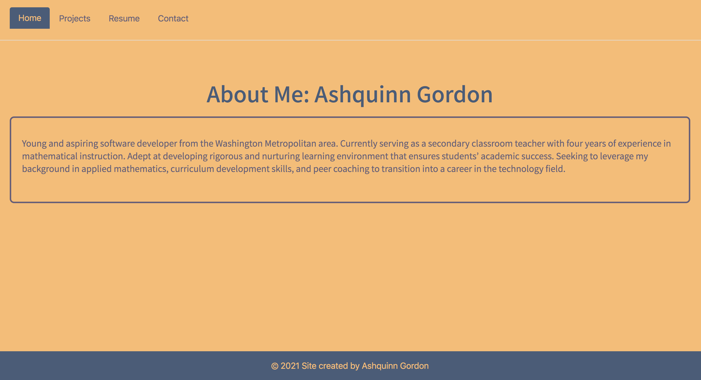
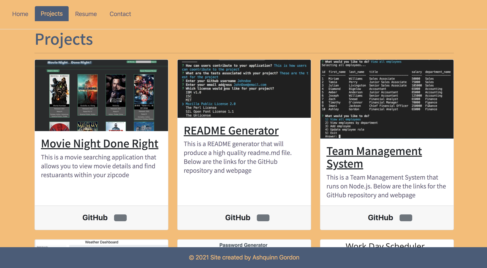

# React Portfolio 

## Description
Simple and easy to navigate portfolio page. This application is constructed using React.js and allows for easy intergration of multiple components onto a single page. There are four main components of the application: About me, Resume, Contect, Projects. The about page provides a brief blurb of the site directore. The resume page contains a link too download a pdf of the resume. The contact page is used for sending a message and communication and lastly the projects page contains serveral cards for various projects. Each card has a title, project name, link to deployed site, and link to source code. 
        
## Deployed Portfolio

[React Portfolio](https://ashquinn.github.io/react_portfolio1/)


## Technologies Used

```
HTML
CSS
JavaScript
React.JS
```


## Libraries

```
Bootstrap
```


## Screenshots




## Questions       
If you have any questions please contact me by email.

* Email: ashquinngordon@gmail.com
        
## License      
Licensed under the MIT license. Use the following link for permissions and allowances:
https://opensource.org/licenses/MIT
